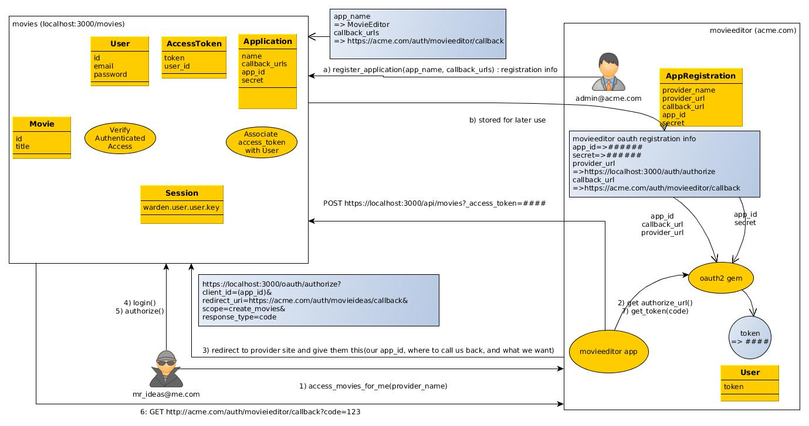

# Accessing Web Services thru OAuth2

This demo provides an example of setting up web services that authenticate using 
OAuth2. We are using 

  * the [`doorkeeper`](https://github.com/doorkeeper-gem/doorkeeper) gem with
  [`doorkeeper-mongodb-extensions](https://github.com/doorkeeper-gem/doorkeeper-mongodb)
  to implement service-level aspects and specifically the OAuth2 protocol exchanges.
  * the [`devise`](https://github.com/plataformatec/devise) gem to manage user
  accounts. Doorkeeper uses Devise to authenticate user access.
  * the [`httpparty`](https://github.com/jnunemaker/httparty) to demonstrate raw 
  HTTP message exchanges
  * the [`oauth2](https://github.com/intridea/oauth2) gem to demonstrate OAuth2
  HTTP message exchanges.
  
## Primary Goals

1. Provide authorized access to web service clients for a limited time
without giving client login credentials to the service. We did not go
as far as restricting the scope of access.

2. Develop a clean separation between HTML and web service access.

3. Leverage OAuth2 as our authentication implementation strategy.
This happens to be capably implemented by the Doorkeeper gem.

4. Leverage Devise as out account management strategy.

## Benefits

OAuth2 provides a secure way to grant rights to resources by 
applications acting on your behalf without handing them your
personal login credentials.

OAuth2 also provides a way for applications to rely on the 
account management and authentication of other applications
(e.g., Facebook, Twitter, GitHub) and relieve it of storing
individual client credential information. This can save users
from having to maintain separate credentials on every site 
and save some sites the burden of protecting that information.
This demonstration did not provide focus in this area, but
the MovieEditor introduced in the demo could have relied on
the OAuth2 provider to be their sole authenticator as long
as it was reasonable for users of the MovieEditor to 
also have an account with the OAuth2 provider. We could
have also separated the example Movies application from 
OAuth2 provider with some complexity. Devise supports
User information being authenticated by external sources
like OAuth2 (refer to the 
[`OmniAuth`](https://github.com/intridea/omniauth) gem)

By focusing on the service API separate from the HTML page
navigation, we created a clean and complete web service
interface ready to complete this challenge.

Devise provides core account management (e.g., sign-up,
recover password, etc.) and has been integrated with
many of the gems associated with authentication and 
authorization. We do very little with Devise in this
example except to install and use it. We found it 
easy to implement browser authentication but a 
bit overwhelming to leverage at the API level. Luckily
OAuth2 takes over authentication responsibilities
and is a snap for APIs to work with once the token
has been generated.


## High Level Workflows

References:

  * [`Introduction to Authentication with OAuth2`](https://www.youtube.com/watch?v=rw_zSCbzRRA)
  * [`OAuth with Doorkeeper YouTube Video`](https://www.youtube.com/watch?v=zN9BylV81rw)

The workflows of OAuth2 can be a lot to chew on and lets describe it
with a use case. The descriptions are much easier to follow when 
the roles have names and faces.


[Example Scenario](./docs/oath-scenario.jpg)

  * Movies Application (`https://localhost:3000`)
    - has list of movies (html pages: `/movies`, api: `/api/movies`)
    - provides unauthenticated access to read-only actions
    - requires authenticated access to write actions
    - logs email of updater in movie (except for destroy)
    - implemented as a Rails application
  * MovieEditor Application(`https://acme.com`)
    - authors new movie ideas
    - not implemented in software
    - actions demonstrated thru a series of commands using HTTParty and
    OAuth2 client gems
  * Mr Ideas (`mr_ideas@me.com`)
    - uses MovieEditor to create his new movie ideas within the Movie
    - wants all movie ideas to be attributed to his account
    - does not share Movie application credentials with MovieEditor
    application
  * Movies OAuth2 Provider (uri: /oauth/...)
    - implemented within same Rails application as Movies Application
  * MovieEditor Admin (`admin@acme.com`)
    - handles MovieEditor oauth application registration with Movies
    - small, one-time bit part in the beginning

Although we will show you many things, our focus is to get to the point where
Mr Ideas can use MovieEditor to create new movies within the Movies application
using his account, but not sharing his credential information with MovieEditor.
Note too that OAuth2 is meant to be used over secure (HTTPS) connections.
This example shows how to setup SSL on the server but, unfortunately conducts 
the core of the demo using non-SSL communications (HTTP). Please keep that in 
mind when doing OAuth2 for real.

We will break up the scenario into three parts

  * service regsitration
    - MovieEditor Admin performs one-time registration setup with Movies OAuthProvider
  * account authorization
    - Mr Ideas authorizes MovieEditor to perform actions on Movies on his behalf
  * resource access
    - MovieEditor creates a movie in Movies Application on behalf of Mr Ideas


### Service Registration

In this section we perform a one-time setup of our MovieEditor within the 
Movie OAuthProvider. Everything we demonstrate here is implemented within 
`Doorkeeper`. Everything else are manual commands to help show the interactions.

a. MovieEditor Admin (`admin@acme.com`) visits Movies OAuthProvider pages to 
register their MovieEditor application. In our example, the application 
management has not yet been secured for authenticated access. This would be
terrible in real life, but it simplifies out demo. Remember we have not
yet reached the maturity level of Facebook, Twitter, Github, etc. -- 
we are only demonstrating the functions they provide as an OAuth2 provider
when registering an application.

    * http://localhost:3000/oauth/applications/new
    * name: MovieEditor
    * redirect uri: http://acme.com/auth/movieeditor/callback
        - URL within MovieEditor to receive authentication codes during
        user authorization of MovieEditor with Movies OAuthProvider
        - for the demo, this does not have to exist. Anything this
        callback reports is available to us in the URL displayed in the
        browser. We will do the rest by hand.
    * scopes: (empty)  
        - used to specify what accesses a service can ask for within Movies
        - blank is the default scope

b. Store the resultant information

    * `app_id="174b57848e057831aa35c3ecfd8461516ea5de629644ebf4b9ba02b1fc6e2e00"`
    * `secret="f4cb86b72264e7e202ab66dcf16fa0cb9590880ae5c675df0a94b315fc845d51"`

    Remember the callback URL Movie OAuthProvider will call with codes

    * `editor_callback_url="http://acme.com/auth/movieeditor/callback"`
    * `movies_oauth_site_url="http://localhost:3000/"`


At this point MovieEditor is fully registered with Movie OAuthProvider.
If we look into our OAuth2 database, we see our MovieEditor registration.

```ruby
> pp db[:oauth_applications].find(:name=>"MovieEditor").first
{"_id"=>BSON::ObjectId('569293dce301d0568500000b'),
 "name"=>"MovieEditor",
 "redirect_uri"=>"http://acme.com/auth/movieeditor/callback",
 "scopes"=>"",
 "uid"=>"174b57848e057831aa35c3ecfd8461516ea5de629644ebf4b9ba02b1fc6e2e00",
 "secret"=>"f4cb86b72264e7e202ab66dcf16fa0cb9590880ae5c675df0a94b315fc845d51",
 "updated_at"=>2016-01-10 17:24:44 UTC,
 "created_at"=>2016-01-10 17:24:44 UTC}
```

### Account Authorization

Mr Ideas has already created an account with Movies thru simple
"Sign up" account management thru Devise but is logged out of
Movies at the moment.

```ruby
> User.find_by(:email=>"mr_ideas@me.com").attributes
{"_id"=>BSON::ObjectId('56929973e301d0568500000c'),
 "email"=>"mr_ideas@me.com",
 "encrypted_password"=>
  "$2a$10$VBDpuTZo1oqvZYB57lHppO1L.Wks8c7n2RW05jFFREjPtWCHHgX3y",
 "sign_in_count"=>1,
 "last_sign_in_at"=>2016-01-10 17:48:35 UTC,
 "current_sign_in_at"=>2016-01-10 17:48:35 UTC,
 "last_sign_in_ip"=>"127.0.0.1",
 "current_sign_in_ip"=>"127.0.0.1"}
```

1.  Mr Ideas accesses the MovieEditor Application, which is just
our rails console for this demonstration. He makes a request 
that MovieEditor perform actions on his behalf and is now about 
to go thru the steps to authenticate with Movies OAuthProvider
and grant account access to MovieEditor.

2. MovieEditor generates the URL that will initiate the process
between the three entities (Mr Ideas, MovieEditor, and OAuth2 Provider).
In this case we are going to use the OAuth2 client gem to help form that
URL. Notice the OAuth2 client can hold onto the `app_id` (obtained 
using the `id` getter), `secret`, and the `base_url` for the OAuth2
provider MovieEditor will be requesting access thru.

    ```ruby
    > client=OAuth2::Client.new(app_id, secret, :site=>movies_oauth_site_url)
    > client.id
     => "174b57848e057831aa35c3ecfd8461516ea5de629644ebf4b9ba02b1fc6e2e00" 
    > client.secret
     => "f4cb86b72264e7e202ab66dcf16fa0cb9590880ae5c675df0a94b315fc845d51"
    > client.site
     => "http://localhost:3000/" 
    > client.auth_code.authorize_params
     => {"response_type"=>"code", 
         "client_id"=>"174b57848e057831aa35c3ecfd8461516ea5de629644ebf4b9ba02b1fc6e2e00"} 
    ```

    The final URL can be built once we include the callback_url
    provided in the registration and identified in this URL thru the 
    `redirect_uri` parameter.

    ```ruby
    > editor_callback_url
     => "http://acme.com/auth/movieeditor/callback" 
    > client.auth_code.authorize_url(redirect_uri:editor_callback_url)
     => "http://localhost:3000/oauth/authorize?
            client_id=174b57848e057831aa35c3ecfd8461516ea5de629644ebf4b9ba02b1fc6e2e00&
            redirect_uri=http%3A%2F%2Facme.com%2Fauth%2Fmovieeditor%2Fcallback&
            response_type=code" 
    ```

3. Mr Ideas' browser will be redirected to the generated authorization URL and 
will be conveying the following information to the OAuth2 Provider:

      * Mr Ideas: "I want to authorize the following application
      identified by `client_id` to act on my behalf at default scope
      (no scopes provided)."

4. The OAuth2 Provider recognizes that Mr Ideas does not have an active login 
session and directs Mr Ideas' browser to the login page. The login is completed
(as Mr Ideas) and Mr Ideas should be presented with an authorization page.
Note: There is a small issue with the example and the user is not automatically
resumed in their route. Paste the `authorization_url` a second time to
continue now that Mr Ideas has now logged in.

5. The authorization page now asks Mr Ideas if he would like to allow
MovieEditor to access the Movies site on his behalf. 

6. Mr Ideas authorizes the request. The access request is recorded within
the OAuth2 provider and Mr Ideas' browser is redirected to a completion
page within MovieEditor. Realize that we have not actually implemented 
MovieEditor and the URL we provided is fake. The important part is that 
there will be a short-lived code included in the URL parameters that 
needs to be manually copied and made available to the rails console.

    * Generated URL:

    ```
    http://acme.com/auth/movieeditor/callback?
       code=5097c0d52f80dc94cc9cc9c68c5bb93c215cff9abb854ac17f25e52a48903b31
    ```

    Store the following in the shell

    * `code="5097c0d52f80dc94cc9cc9c68c5bb93c215cff9abb854ac17f25e52a48903b31"`

7. MovieEditor can continue to use the OAuth2 client to complete the handshake
to derive an access token. The following call invokes a `/oauth/token` URI
in the OAuth2 Provider, which validates the information provided, and 
returns the access token to use.

    ```ruby
    > editor_callback_url
     => "http://acme.com/auth/movieeditor/callback"

    > access = client.auth_code.get_token(code, redirect_uri: editor_callback_url)
    > oauth_token=access.token
     => "be9d0432840d2575cf4c3f5309c3abecec499f267150514030d8c1a1d5b96194" 
    ``` 

As we finish this section, the caller using the generated `oauth_token` will
be able to use that token to authorize each call and perform their intended
purpose on behalf of Mr Ideas.

### Resource Access

In this section, Mr Ideas is going to use MovieEditor to create a new 
movie he has been thinking up. MovieEditor can implement the exchange
with the Movies Application one of two ways:

  * using straight HTTPParty
  * using the OAuth2 client

They are very similar in function, but the OAuth2 client automatically inserts
the access token. 

1. Mr Ideas has the new idea to create a new movie called "Rocky30". 
MovieEditor issues the following command but fails to include the access
token in the request. Note the:

    * 401/Unauthorized response
    * Error message included in the `www-authenticate` response header

```
> response=HTTParty.post("http://localhost:3000/api/movies",
                         :body=>{:movie=>{:id=>"12330", :title=>"rocky30"}})
> response.response
 => #<Net::HTTPUnauthorized 401 Unauthorized readbody=true> 
> response.header["www-authenticate"]
 => "Bearer realm=\"Doorkeeper\", error=\"invalid_token\", 
   error_description=\"The access token is invalid\"" 
```

2. The software team was called in to correct the error and now have 
specified the OAuth2 token using the `:access_token` key and included
it within the POST body so that it can stay within the payload and
out of the URL if it were ever to be accidentally used without HTTPS
(like in this demo).

    ```ruby
    > oauth_token
     => "be9d0432840d2575cf4c3f5309c3abecec499f267150514030d8c1a1d5b96194" 
    > response=HTTParty.post("http://localhost:3000/api/movies", :body=>{
         :movie=>{:id=>"12330", :title=>"rocky30"},
         :access_token=>oauth_token})
    > response.response
     => #<Net::HTTPCreated 201 Created readbody=true> 
    ```

    Notice the request was successfully associated with Mr Ideas during the 
    create and our business logic logged his contact email within the Movie
    document.

    ```
    > pp JSON.parse(response.body)
    {"_id"=>"12330", "last_modifier"=>"mr_ideas@me.com", "title"=>"rocky30"}
    ```

3. The software team learns they can also have the token automatically 
inserted when using the OAuth2 client. Here we show them building the 
basic elements of the OAuth::Client to perform update functions. All
that is required is the `:site` URL and OAuth2 access token to get started.

    ```ruby
    > movies_oauth_site_url
     => "http://localhost:3000/" 
    > client2=OAuth2::Client.new(nil, nil, :site=>movies_oauth_site_url)                 
    > oauth_client=OAuth2::AccessToken.new(client2,oauth_token)                          
    ```

    Mr Ideas thinks a movie called "rocky3000" would sound better than
    "rocky30", so he causes MovieEditor to issue a change (PUT) on his 
    behalf.

    ```ruby
    > response=oauth_client.put("/api/movies/12330",:body=>{:movie=>{:title=>"rocky3000"}})
    > response.response.status
     => 204 
    ```

    The change is observed thru a follow-on request (GET).

    ```ruby
    > response=oauth_client.get("/api/movies/12330")
    > response.response.status
     => 200 
    > pp JSON.parse(response.body)
    {"_id"=>"12330", "last_modifier"=>"mr_ideas@me.com", "title"=>"rocky3000"}
    ```

## Poking Around

Just for fun and curiousity, lets poke aound in the OAuth2 database to see
what we can learn.

The following are some of the key IDs and variable values we used in
the above scenario.

```ruby
> mr_ideas_id=User.find_by(:email=>"mr_ideas@me.com")[:_id]
 => BSON::ObjectId('56929973e301d0568500000c') 
> db=User.mongo_client
> movie_editor_id=pp db[:oauth_applications].find(:name=>"MovieEditor").first[:_id]
 => BSON::ObjectId('569293dce301d0568500000b')
 > oauth_token
 => "be9d0432840d2575cf4c3f5309c3abecec499f267150514030d8c1a1d5b96194"
 > code
 => "5097c0d52f80dc94cc9cc9c68c5bb93c215cff9abb854ac17f25e52a48903b31"
```

Notice that the `access_grants` collection has a document that associates the 
MovieEditor Application, Mr Ideas, and the code that was returned 
during the authorization step. That code is now listed as revoked.

```ruby
> pp db[:oauth_access_grants].find(:resource_owner_id=>mr_ideas_id).first
{"_id"=>BSON::ObjectId('5692a8bde301d0568500000d'),
 "application_id"=>BSON::ObjectId('569293dce301d0568500000b'),
 "resource_owner_id"=>BSON::ObjectId('56929973e301d0568500000c'),
 "expires_in"=>600,
 "redirect_uri"=>"http://acme.com/auth/movieeditor/callback",
 "scopes"=>"",
 "token"=>"5097c0d52f80dc94cc9cc9c68c5bb93c215cff9abb854ac17f25e52a48903b31",
 "updated_at"=>2016-01-10 19:03:29 UTC,
 "created_at"=>2016-01-10 18:53:49 UTC,
 "revoked_at"=>2016-01-10 19:03:29 UTC}
```

Notice that the `access_tokens` collection has a document that also 
associates the MovieEditor Application and Mr Ideas that looks active
and created after the `access_grant` but created at the same time the
`access_grant` was last modified. The token field listed has our 
OAuth2 token.

```ruby
> pp db[:oauth_access_tokens].find(:resource_owner_id=>mr_ideas_id).first
{"_id"=>BSON::ObjectId('5692ab01e301d0568500000e'),
 "application_id"=>BSON::ObjectId('569293dce301d0568500000b'),
 "resource_owner_id"=>BSON::ObjectId('56929973e301d0568500000c'),
 "scopes"=>"",
 "expires_in"=>7200,
 "token"=>"be9d0432840d2575cf4c3f5309c3abecec499f267150514030d8c1a1d5b96194",
 "updated_at"=>2016-01-10 19:03:29 UTC,
 "created_at"=>2016-01-10 19:03:29 UTC}
```

Note also that Doorkeeper makes a `doorkeeper_token` function available
to all controllers and when we want to locate the `current_user` we 
are asked to access the `resource_owner_id` property. That makes sense
looking at the `oauth_access_tokens` collection above.
       
```ruby
@current_user=User.where(:id=>doorkeeper_token.resource_owner_id).first
```

## Assembly

The following sections describes how the example was constructed.

### Core Setup

1. Create new Rails application

    ```
    $ rails g oauth_movies
    $ cd oauth_movies
    ```

2. Add gems

    * `Gemfile`: gem 'mongoid', '~> 5.0', '>= 5.0.2'
    * `Gemfile`: gem 'httparty', '~> 0.13.7'

    ```shell
    $ bundle
    ```

3. Integrate Mongoid

    * `$ rails g mongoid:config`
    * `config/application.rb`: `Mongoid.load!('./config/mongoid.yml')`

4. Define a root URL. The following generates a `PagesController` with a single
action called `index`.

    ```shell
    $ rails g controller pages index
    ```

    ```ruby
    # config/routes.rb
    Rails.application.routes.draw do
      #get 'pages/index'
      root to: 'pages#index'
    ```

5. At this point, you should be able to start the server and access the default
root URI page. The controller page we created is the only URI so far.

    ```shell
    $ rake routes
    Prefix Verb URI Pattern Controller#Action
      root GET  /           pages#index

    ```

6. Start your server to access the root URI using HTTP in both the browser 
and HTTParty from the rails console.

    ```shell
    $ rails s
    ```

    * HTTP to root URI access thru browser

    ```text
    #http://localhost:3000
    Pages#index
    Find me in app/views/pages/index.html.erb
    ```

    * HTTP to root URI access thru HTTParty client running within 
    rails console.

    ```ruby
    $ rails c
    > response=HTTParty.get("http://localhost:3000/")
    > response.response
     => #<Net::HTTPOK 200 OK  readbody=true> 
    ```

## SSL Setup

Since this is a security topic, we cannot go without at least a token
amount of SSL setup even though we may run most of our development without it.
The easiest way I have found to run with SSL and Rails is to replace the 
default `WEBrick` server with [`Thin`](https://github.com/macournoyer/thin/).
The `Thin` server comes fully assembled for SSL communications suitable for
a development environment using a simple command line.

1. Stop your server.

2. Add the `Thin` gem and run bundle.

    * `Gemfile`: gem 'thin', '~> 1.6', '>= 1.6.4'

    ```shell
    $ bundle
    ```

3. Start the server with the following command

    ```shell
    $ thin start --ssl
    Using rack adapter
    Thin web server (v1.6.4 codename Gob Bluth)
    Maximum connections set to 1024
    Listening on 0.0.0.0:3000, CTRL+C to stop
    ```

5. Access the root URI using HTTPS in both the browser 
and HTTParty from the rails console.

    ```text
    #https://localhost:3000
    Pages#index
    Find me in app/views/pages/index.html.erb
    ```

    If you attempt to access the SSL-protected page from HTTParty without
    modification, you should see an SSLError exception stating the host
    cannot be verified.

    ```ruby
    > HTTParty.get("https://localhost:3000")
    OpenSSL::SSL::SSLError: SSL_connect returned=1 errno=0 state=SSLv3 
        read server certificate B: certificate verify failed
    ```

    We are not going to go into SSL setup, so tell HTTParty not to
    verify the certificate provided by the server and to simply
    exchange encrypted messages using the certificate provided.

    ```ruby
    > response=HTTParty.get("https://localhost:3000",:verify=>false)
    > response.response
     => #<Net::HTTPOK 200 OK readbody=true> 
    ```

6. You may want to revert back to HTTP and chose specific times when
to try HTTPS. You can keep `Thin` as your web server. Personally it 
starts much faster in my environment and I enjoy that small luxury.

    ```
    $ thin start --ssl
    Listening on 0.0.0.0:3000, CTRL+C to stop
        <Control+C>
    Stopping ...
    $ rails s
    => Booting Thin
    => Rails 4.2.4 application starting in development on http://localhost:3000
    => Run `rails server -h` for more startup options
    => Ctrl-C to shutdown server
    Thin web server (v1.6.4 codename Gob Bluth)
    Maximum connections set to 1024
    Listening on localhost:3000, CTRL+C to stop
    ```

## Resource Access

Here is where we create the resources that are unique to our applications
and our access to them.

### Resouce Model

1. Create a Movies resource. There is no need to
specifically name the `id` field when generating 
a model class.

    ```shell
    $ rails g model Movie id title
    ```

2. Add timestamp support to the model class.
Also add a `last_modifier` field where we will
store the identity of the authenticated user that 
modifies a Movie.

    ```ruby
    class Movie
      include Mongoid::Document
      include Mongoid::Timestamps
      field :title, type: String
      field :last_modifier, type: String
    end
    ```

### Resource Controller

We will create both an HTML and an /api-specific
URI and controller to handle access to our model.
That way it will allow the core WS and HTML actions
and flows to be more easily defined and identifiable
in our use.

#### HTML Controller

1. Add a Movies controller. Be sure to include the 
`id` as one of the fields so that it is included 
in the default views and is white-listed in the 
controller.

    ```ruby
    $ rails g scaffold_controller Movies id title
    ```
2. Make sure the default routing is in place for the
movies resources in the routes.

    ```ruby
    # config/routes.rb
    resources :movies  
    ```

#### API Controller

For the API Controller, we are going to take advantage 
of some automatic marshalling that is available to us
using the [`responders`](http://www.rubydoc.info/gems/responders/2.1.1) gem.
To do that, we must start with adding the gem.

1. Update the Gemfile with the `responders` gem, run 
bundle, and restart your server.

    ```ruby
    gem 'responders', '~> 2.1', '>= 2.1.1'
    ```
    ```shell
    Control+C
    $ bundle
    $ rails s
    ```

2. Create an `app/controller/api` directory and place the 
the following controller files into that directory.

    The base controller will be used to hold any 
    properties that are common to all API classes.

    ```ruby
    # app/controllers/api/base_controller.rb
    module Api
      class BaseController < ApplicationController
        protect_from_forgery with: :null_session
        respond_to :json
      end
    end
    ```

    The Api::MoviesController class focuses on web 
    service interaction.

    ```ruby
    #app/controllers/api/movies_controller.rb
    module Api
      class MoviesController < Api::BaseController
        before_action :set_movie, only: [:show, :edit, :update, :destroy]

        def index
          respond_with Movie.all
        end
        def show
          respond_with @movie
        end
        def create
          respond_with Movie.create(movie_params)
        end
        def update
          respond_with @movie.update(movie_params)
        end
        def destroy
          respond_with @movie.destroy
        end

        private
          def set_movie
            @movie = Movie.find(params[:id])

            rescue Mongoid::Errors::DocumentNotFound => e
              respond_to do |format|
                format.json { render json: {msg:"movie[#{params[:id]}] not found"}, status: :not_found }
              end
          end
          def movie_params
            params.require(:movie).permit(:id, :title)
          end
      end
    end
    ```

3. Add URI routes to the API Controller.

    ```ruby
    #config/routes.rb
      resources :movies  
      namespace :api, defaults: {format: 'json'} do
        resources :movies
      end
    ```


#### Test Drive

Verify access to the movies resource.

1. In the rails console, add an initial movie.

    ```ruby
    > response=HTTParty.post("http://localhost:3000/api/movies",:body=>{:movie=>{:id=>"12345", :title=>"rocky25"}})
    > response.response
     => #<Net::HTTPCreated 201 Created readbody=true> 
    > pp JSON.parse(response.body)
    {"_id"=>"12345", "title"=>"rocky25"}
    ```
2. In the rails console, update an existing movie.

    ```ruby
    > response=HTTParty.put("http://localhost:3000/api/movies/12345",:body=>{:movie=>{:title=>"rocky25.5"}})
    > response.response
     => #<Net::HTTPNoContent 204 No Content readbody=true> 
    ```

3. In the rails console, get an existing and non-existing movie

    ```ruby
    > response=HTTParty.get("http://localhost:3000/api/movies/12345")
    > response.response
     => #<Net::HTTPOK 200 OK readbody=true> 
    > pp JSON.parse(response.body)
    {"_id"=>"12345", "title"=>"rocky25.5"}
     => {"_id"=>"12345", "title"=>"rocky25.5"} 
    ```
    ```ruby
    > response=HTTParty.get("http://localhost:3000/api/movies/123")
    > response.response
     => #<Net::HTTPNotFound 404 Not Found readbody=true> 
    > pp JSON.parse(response.body)
    {"msg"=>"movie[123] not found"}
    ```

3. In the rails console, delete an existing movie

    ```http
    > response=HTTParty.delete("http://localhost:3000/api/movies/12345")
    > response.response
     => #<Net::HTTPNoContent 204 No Content readbody=true> 
    ```


### Integrate Devise

The following will configure Devise in the most default and straight forward 
manner. Options chosen and exposed will be described here, but to keep this 
as straight forward as possible, see the 
[`Devise Authentication in Depth`](http://www.sitepoint.com/devise-authentication-in-depth/)
article, which was the original source of much of this information.

#### Gemfile and Configuration

1. Add the devise gem to your Gemfile, run bundle, and restart your server.

    ```
    #Gemfile
    gem 'devise', '~> 3.5', '>= 3.5.3'
    ```
    ```
    Control+C
    $ bundle
    $ rails s
    ```

2. Generate the Device configuration file using `rails g`.

    ```shell
    $ rails generate devise:install
          create  config/initializers/devise.rb
          create  config/locales/devise.en.yml
    ```

3. Define a URL for generated e-mail messages to reference back to the server.
This will be set to `localhost:3000` in the development environment and shows 
up in e-mail messages generated to coordinate user accounts. Until a mailer 
is setup (not as a part of this demo), all e-mails will be written to the 
server log.

    ```ruby
    #config/environments/development.rb
      #devise options
      config.action_mailer.default_url_options = { host: 'localhost', port: 3000 }
    ```


#### User Model Class for Account

The User model class is the class that will hold accounts in your service.
This is what someone is validated against when they authenticate thru standard
means.

1. Generate an Active Model (Mongoid is configured to be default ORM) to 
represent the User for Devise. The name of this resource can be application-specific
and there can be multiple user models within an application (e.g., users and admins).

    ```shell
    $ rails g devise user
    ```

    This generates the following model class. It can be customized, but any additions
    you make the the field properties (e.g., `name`) must be registered with Devise
    (see [`Strong_params and Edit Profile Page`](http://www.sitepoint.com/devise-authentication-in-depth/)).
    Confirmable and lockable are disabled by default and we will leave it that way
    so that we are not required to go thru an e-mail or fake-email process of activating
    the account and automatically recovering the account if we lost the password. All
    those features are easy to do - but are not the focus of our secure communications
    focus in this example. `database_authenticatable` is likely the most important to 
    us as well use the database for most authentications.

    ```ruby
    class User
      include Mongoid::Document
      # Include default devise modules. Others available are:
      # :confirmable, :lockable, :timeoutable and :omniauthable
      devise :database_authenticatable, :registerable,
             :recoverable, :rememberable, :trackable, :validatable

      ## Database authenticatable
      field :email,              type: String, default: ""
      field :encrypted_password, type: String, default: ""

      ## Recoverable
      field :reset_password_token,   type: String
      field :reset_password_sent_at, type: Time

      ## Rememberable
      field :remember_created_at, type: Time

      ## Trackable
      field :sign_in_count,      type: Integer, default: 0
      field :current_sign_in_at, type: Time
      field :last_sign_in_at,    type: Time
      field :current_sign_in_ip, type: String
      field :last_sign_in_ip,    type: String

      ## Confirmable
      # field :confirmation_token,   type: String
      # field :confirmed_at,         type: Time
      # field :confirmation_sent_at, type: Time
      # field :unconfirmed_email,    type: String # Only if using reconfirmable

      ## Lockable
      # field :failed_attempts, type: Integer, default: 0 # Only if lock strategy is :failed_attempts
      # field :unlock_token,    type: String # Only if unlock strategy is :email or :both
      # field :locked_at,       type: Time
    end
    ```

    It also produces the following routes and uri helper methods. The actions witin the devise controller
    are within the devise gem and can be extracted and customized using `rails g devise:views`, but we 
    will not be doing that here.

    ```shell
    $ rake routes | grep devise
            new_user_session GET    /users/sign_in(.:format)       devise/sessions#new
                user_session POST   /users/sign_in(.:format)       devise/sessions#create
        destroy_user_session DELETE /users/sign_out(.:format)      devise/sessions#destroy
               user_password POST   /users/password(.:format)      devise/passwords#create
           new_user_password GET    /users/password/new(.:format)  devise/passwords#new
          edit_user_password GET    /users/password/edit(.:format) devise/passwords#edit
                             PATCH  /users/password(.:format)      devise/passwords#update
                             PUT    /users/password(.:format)      devise/passwords#update
    cancel_user_registration GET    /users/cancel(.:format)        devise/registrations#cancel
           user_registration POST   /users(.:format)               devise/registrations#create
       new_user_registration GET    /users/sign_up(.:format)       devise/registrations#new
      edit_user_registration GET    /users/edit(.:format)          devise/registrations#edit
                             PATCH  /users(.:format)               devise/registrations#update
                             PUT    /users(.:format)               devise/registrations#update
                             DELETE /users(.:format)               devise/registrations#destroy
    ```

    Devise manages three (3) primary resources for our user:
      
      * login sessions - login/logout
      * passwords, and 
      * registration data - email, optional fields

2. Update the index page with a simple set of links to establish a
login. Notice within the page the following calls being made: Devise
provides two helper methods associated with the user model.

    * `user_signed_in?` - returns true if the caller is a logged in user
    * `current_user` - returns the user model instance or nil depending 
      on whether the user is signed in.

    The use model is the model class you created in an earlier step.


    ```html
    # app/views/pages/index.html.erb 
    <% if user_signed_in? %>
        <h2>Logged In As: <%= current_user.email %></h2>
        <ul>
          <li><%= link_to 'Log out', destroy_user_session_path, method: :delete %></li>
          <li><%= link_to 'Profile', edit_user_registration_path %></li>
    <% else %>
        <h2>Welcome!</h2>
        <ul>
          <li><%= link_to 'Log In', new_user_session_path %></li>
          <li><%= link_to 'Sign Up', new_user_registration_path %></li>
    <% end %>
    </ul>
    ```

3. Restart your server to avoid the following and other errors related to devise-related 
resources not being found in the next step.
[`reference`](https://github.com/plataformatec/devise/issues/1773)

    ```text
    Showing .../gems/devise-3.5.3/app/views/devise/registrations/new.html.erb where line #3 raised:

    undefined method `registration_path' for #<#<Class:0x00000005704a18>:0x007feddee76200>
    ```

    ```shell
    <Control+C>
    $ rails s
    ```

4. At this point you should see a sign-up/login page as your default page.


    ```text
    # http://localhost:3000/
    Welcome!

    Log In
    Sign Up
    ```

5. Sign up for an account.

    ```text
    Sign up

    Email
    _____________________
    Password (8 characters minimum) 
    _____________________
    Password confirmation
    _____________________
    [Sign up]
    Log in
    ```

    ```text
    Welcome! You have signed up successfully.

    Logged In As: foo@foo.com

    Log out
    Profile
    ```

6. Use the rails console to inspect the database once account has
been created to be able to see what is being stored about the user.
We see that all information is being stored in a single collection.

    ```ruby
    > User.mongo_client.database.collection_names
     => ["movies", "users"]
    > User.collection.name
     => "users" 
    > pp User.first.attributes
    {"_id"=>BSON::ObjectId('5691b7d6e301d04782000000'),
     "email"=>"foo@foo.com",
     "encrypted_password"=>
      "$2a$10$MYT5.3DF5zuJYZ9EQ6arn.EFm3KGK5j3y0UH2G6YfI8Fnke9vk4ty",
     "sign_in_count"=>1,
     "last_sign_in_at"=>2016-01-10 01:45:58 UTC,
     "current_sign_in_at"=>2016-01-10 01:45:58 UTC,
     "last_sign_in_ip"=>"127.0.0.1",
     "current_sign_in_ip"=>"127.0.0.1"}
    ```

#### Require Authenticated User Access for Write Actions

1. Logout and access the following URL to demonstrate that authentication is 
not yet required. You should be unable to navigate to the following page unless
you are logged in, but that is currently not the case.

    ```http
    http://localhost:3000/movies/12345/edit
    ```

    If the movie above does not currently exist -- create using the
    rails console and repeat the previous action.

    ```ruby
    > HTTParty.post("http://localhost:3000/api/movies",
                    :body=>{:movie=>{:id=>"12345", :title=>"rocky25"}})
    ```

2. Add the following to the PagesController and have all HTML-based
controllers extend the PagesController. The following `before_actions`
will require authentication and route the user to the login page for 
non-readonly views.

    ```ruby
    # app/controllers/pages_controller.rb
    class PagesController < ApplicationController
      before_action :authenticate_user!, except: [:index, :show ]
      before_action :user_signed_in?, except: [:index, :show ]
    ```
    ```ruby
    # app/controllers/movies_controller.rb
    class MoviesController < PagesController
    ```

3. Re-fresh the page and notice you are re-directed to a login page.

    ```
    # http://localhost:3000/users/sign_in
    You need to sign in or sign up before continuing.
    ```

4. Login and verify can access the edit page.

    ```http
    http://localhost:3000/movies/12345/edit
    ```

#### Require Authenticated WS Access for Write Actions

1. Add a change for sign-in and authentication in the API 
base controller for write actions. Except for this interface
they should get a 401/Unauthorized response rendered and not
a re-direct.

    ```ruby
    module Api
      class BaseController < ApplicationController
        before_action :authenticate_user!, except: [:index, :show ]
        before_action :user_signed_in?, except: [:index, :show ]
    ```

2. Verify access is still accessible to non-writable methods
for the `/api` resources.

    ```ruby
    > response=HTTParty.get("http://localhost:3000/api/movies")
    > response.response
     => #<Net::HTTPOK 200 OK readbody=true> 
    > pp JSON.parse(response.body)
    [{"_id"=>"12345", "title"=>"rocky25"}]
    ```
    ```ruby
    > response=HTTParty.get("http://localhost:3000/api/movies/12345")
    > response.response
     => #<Net::HTTPOK 200 OK readbody=true> 
    > pp JSON.parse(response.body)
    {"_id"=>"12345", "title"=>"rocky25"}
    ```

3. Verify access is denied (until authentication) for the writable
methods for the `/api` methods.

    ```ruby
    > response=HTTParty.post("http://localhost:3000/api/movies",
       :body=>{:movie=>{:id=>"12346", :title=>"rocky26"}})
    > response.response
     => #<Net::HTTPUnauthorized 401 Unauthorized readbody=true> 
    > pp JSON.parse(response.body)
    {"error"=>"You need to sign in or sign up before continuing."}
    ```

    Note that the 401/Unauthorized response and no re-direct 
    occurred by default. This is because Devise has a configuration
    of content types that will get re-directed and the rest will
    get denied. By default, all content types except `.html` work
    that way. We do not want to change this default behavior.

    ```
    #config/initializers/devise.rb
    # config.navigational_formats = ['*/*', :html]
    ```

At this point we have Devise protecting both the HTML pages and 
API actions. The can work except:

  * We would have to provide our credentials to web services
  acting on our behalf
  * It is quite painful (as evidenced by the numerous newsgroup
  posts and the scrapes and cuts we personally suffered) to 
  go thru the Devise authentication process with cookes and 
  changing authenticity tokens to worry about. OAuth2 is much 
  easier on the service client to work with.

## Doorkeeper Setup

This will allow us to turn our Devise account management into an 
OAuth2 provider to be used by web service clients as well as to 
provide local authentication verification. The following 
Railscast video was quite helpful in the making of this overall example.
It explores a bit more OAuth2 than tackled here.

  * [`OAuth with Doorkeeper YouTube Video`](https://www.youtube.com/watch?v=zN9BylV81rw)

1. Add `doorkeeper` gem and mongoid support gem to Gemfile. Also add the 
`oauth2` gem so that it is available to us in the rails console.

    ```ruby
    gem 'doorkeeper', '~> 3.1'
    gem "doorkeeper-mongodb", github: "doorkeeper-gem/doorkeeper-mongodb"
    gem 'oauth2', '~> 1.0'
    ```
    ```shell
    Control+C
    $ bundle
    rails s
    ```

2. Install Doorkeeper into application using `rails g`. This
adds a few files to the application.

    ```shell
    $ rails g doorkeeper:install
    ```

    That added a single line to the routes file, which produced the 
    following URIs.

    ```ruby
    # config/routes.rb
    use_doorkeeper
    ```

    ```shell
$ rake routes | grep doorkeeper
                              GET    /oauth/authorize/:code(.:format)             doorkeeper/authorizations#show
          oauth_authorization GET    /oauth/authorize(.:format)                   doorkeeper/authorizations#new
                              POST   /oauth/authorize(.:format)                   doorkeeper/authorizations#create
                              DELETE /oauth/authorize(.:format)                   doorkeeper/authorizations#destroy
                  oauth_token POST   /oauth/token(.:format)                       doorkeeper/tokens#create
                 oauth_revoke POST   /oauth/revoke(.:format)                      doorkeeper/tokens#revoke
           oauth_applications GET    /oauth/applications(.:format)                doorkeeper/applications#index
                              POST   /oauth/applications(.:format)                doorkeeper/applications#create
        new_oauth_application GET    /oauth/applications/new(.:format)            doorkeeper/applications#new
       edit_oauth_application GET    /oauth/applications/:id/edit(.:format)       doorkeeper/applications#edit
            oauth_application GET    /oauth/applications/:id(.:format)            doorkeeper/applications#show
                              PATCH  /oauth/applications/:id(.:format)            doorkeeper/applications#update
                              PUT    /oauth/applications/:id(.:format)            doorkeeper/applications#update
                              DELETE /oauth/applications/:id(.:format)            doorkeeper/applications#destroy
oauth_authorized_applications GET    /oauth/authorized_applications(.:format)     doorkeeper/authorized_applications#index
 oauth_authorized_application DELETE /oauth/authorized_applications/:id(.:format) doorkeeper/authorized_applications#destroy
             oauth_token_info GET    /oauth/token/info(.:format)                  doorkeeper/token_info#show
    ```

4. Configure the ORM and prepare the database. In this case we are
changing from `active_record` to `mongoid`.

    ```ruby
    #config/initializers/doorkeeper.rb
    Doorkeeper.configure do
      # Change the ORM that doorkeeper will use (needs plugins)
      #orm :active_record
      orm :mongoid5
    ```

    Since we are using Mongoid, we just need to
    install indexes. There is no need for an ActiveRecord
    migration.

    ```shell
    $ rake db:mongoid:create_indexes
    ```

    Doorkeeper looks to have added three new collections to the database.

    ```
    > User.mongo_client.database.collection_names
     => ["movies", "oauth_access_grants", "oauth_access_tokens", "oauth_applications", "users"] 
    ```

5. Update the `resource_owner_authenticator` block to be able to resolve
our `User` object based on what is being stored in the session.  Be sure
to restart the server after you have edited this file.

    * Convert the sample `User.find_by_id` to Mongoid syntax and implement
    it as a where() clause instead of a find() so that an exception will not
    be thrown when the user is not found.
    * Access the `user_id` from within a `session["warden.user.user.key"][0][0]`
    location stored there by our Devise login.
    * During the scenario demos, a navigation issue was mentioned about having 
    to re-enter the OAuth2 authentication URL a second time after the user finished
    logging in. The Rails cast hinted that the solution likely involved adjusting
    the `redirect_to` call made when we do not have a user session. There is an
    option to have an additional URL navigated to when complete. This has not
    yet need persued.

    ```ruby
    resource_owner_authenticator do
      #fail "Please configure doorkeeper resource_owner_authenticator block located in #{__FILE__}"
      # Put your resource owner authentication logic here.
      # Example implementation:
      #   User.find_by_id(session[:user_id]) || redirect_to(new_user_session_url)
      user_key=session["warden.user.user.key"]
      user_id=user_key[0][0]  if user_key
      User.where(:id=>user_id).first || redirect_to(new_user_session_url)
    end
    ```

    Notice the default URI for the redirect when the user cannot be found matches
    what was provided by Devise.

    ```ruby
    $ rake routes | grep new_user_session
       new_user_session GET    /users/sign_in(.:format)         devise/sessions#new
    ```

    We currently do not have role-based login, but obviously access to the application
    registrations should be restricted and this unchartered setting allows one to do that.

    ```ruby
    # admin_authenticator do
    #   # Put your admin authentication logic here.
    #   # Example implementation:
    #   Admin.find_by_id(session[:admin_id]) || redirect_to(new_admin_session_url)
    # end
    ```

6. After restarting your server, you can test your previous configuration by 
doing the following.

    * Logout if currently logged into Devise.

    ```url
    http://localhost:3000/
    ```

    * Navigate to the following OAuth2 URI that requires an authenticated
    user session. 

    ```url
    http://localhost:3000/oauth/authorize/123
    ```
    This URI will trigger the `resource_owner_authenticator` configured
    above and should take you to the login page because of the redirect
    when the user is not found.  You will also see the following output
    in the server log indicating there was no user_id in the session and
    no user found for the action, thus the re-direct to the login page.

    ```
    Started GET "/oauth/authorize" for 127.0.0.1 at 2016-01-10 01:39:31 -0500
    Processing by Doorkeeper::AuthorizationsController#new as HTML
    D | {"find"=>"users", "filter"=>{"_id"=>nil}, "limit"=>-1}
    Redirected to http://localhost:3000/users/sign_in
    ```
    * Complete the Login with Devise.

    * Return the the URL attempted earlier. 

    ```url
    http://localhost:3000/oauth/authorize/123
    ```

    You will see a non-nil user_id provided when locating the current user
    for this bogus action.

    ```ruby
    Started GET "/oauth/authorize/123" for 127.0.0.1 at 2016-01-10 01:50:23 -0500
    Processing by Doorkeeper::AuthorizationsController#show as HTML
      Parameters: {"code"=>"[FILTERED]"}
    D, | {"find"=>"users", "filter"=>{"_id"=>BSON::ObjectId('5691b7d6e301d04782000000')}, "limit"=>-1}
    ```

### Register Application with OAuth

We are going to setup a registration between a pretend client running at `acme.com` 
and our `Movies` service and OAuth2 provider running at `localhost:3000`. We will 
use the terms client/acme.com and movies/localhost:3000 to try to get some 
clarity of the two roles about to participate in the following session.

1. Sign-up for a new account with the movies server as `wiley@acme.com` 
and log into that account.

2. Navigate to the `oauth/applications` page and register a new application.

    * Name: Acme Client
    * Redirect URL: `http://acme.com/auth/movies/callback`
    * Scopes: (blank)

    Result

    * Application Id: `44381a6e079b98720b356cd354ed8cdf232056350ad451f51a0559b1d8cf016c`
    * Secret: `56e6815bc906de1a99a05b1c16c16dc13eb4b6a5702f98c965749eaf51208c29`
    * Callback URLs: `http://localhost:3001/auth/movies/callback`

2. Using the `oauth2` gem, take the provided information and generate a authorization
URL for the OAuth2 provider to use to report a generated key. 


    ```
    > app_id="44381a6e079b98720b356cd354ed8cdf232056350ad451f51a0559b1d8cf016c"
    > secret="56e6815bc906de1a99a05b1c16c16dc13eb4b6a5702f98c965749eaf51208c29"
    > callback="http://localhost:3001/auth/movies/callback"
    > client=OAuth2::Client.new(app_id, secret, site:"http://localhost:3000/")
    ```

    This URL consists of
    
    * the hostname:port of the OAuth2 server
    * the `app_id`, which is also being called `client_id`
    * the `callback URL`, which is being called the `redirect_uri`
    * the `response_type` of `code`

    ```ruby
    > client=OAuth2::Client.new(app_id, secret, site:"http://localhost:3000/")
    > client.auth_code.authorize_url(redirect_uri: callback)
     => "http://localhost:3000/oauth/authorize?
       client_id=44381a6e079b98720b356cd354ed8cdf232056350ad451f51a0559b1d8cf016c&
       redirect_uri=http%3A%2F%2Flocalhost%3A3001%2Fauth%2Fmovies%2Fcallback&
       response_type=code" 
    ```

2. Plug the authorization URL into a browser and we should get re-directed to 
the callback URL, which does not yet exist. However, the information it would 
have provided it is available to us in the code parameter of the failed URL.


    ```ruby
    http://localhost:3001/auth/movies/callback?
        code=6f15275bdd7e10f2b0dae67271e8ee911542a8bf772183a251bde769d2786c0f
    ```

3. Grab the `code` from the URL and use it to generate an access token.

    ```ruby    
    > code="6f15275bdd7e10f2b0dae67271e8ee911542a8bf772183a251bde769d2786c0f"
     => "6f15275bdd7e10f2b0dae67271e8ee911542a8bf772183a251bde769d2786c0f" 
    > access = client.auth_code.get_token(code, redirect_uri: callback)
    > access.token
     => "e78f9794bd99e7d09ba106ef7b5e194704b73e54e1fff91dd4c476afd5ff1d65" 
    ```

    Note that if you wait too long (~5min), the code may have expired
    but you can request a new one by calling the authorize_url a second time.

    ```ruby
    > access = client.auth_code.get_token(code, redirect_uri: callback)
    OAuth2::Error: invalid_grant: The provided authorization grant is
    invalid, expired, revoked, does not match the redirection URI used in
    the authorization request, or was issued to another client.
    ```

### Access Application

1. Remove Devise as an authentication check to gain access to the API.
Replace it with the `:doorkeeper_authorize!` `before_action` and continue
to protect only write actions.

    ```
    module Api
      class BaseController < ApplicationController
    #    before_action :authenticate_user!, except: [:index, :show ]
    #    before_action :user_signed_in?, except: [:index, :show ]
        before_action :doorkeeper_authorize! , except: [:index, :show ]
        protect_from_forgery with: :null_session
        respond_to :json
      end
    end
    ```

2. Update the API Movie Controller to locate the current user for modification
actions and insert the user's email address into the Movie document when modified.
Notice that this value is not white-listed and cannot be send in by the caller.
It comes from the authenticated user within the service.

```
      def movie_params
        email=current_user.email  if current_user
        params.require(:movie).permit(:id, :title).merge({:last_modifier=>email})
      end

      def current_user
        unless @current_user
          if doorkeeper_token && doorkeeper_token.resource_owner_id
            @current_user=User.where(:id=>doorkeeper_token.resource_owner_id).first
          end    
        end
        @current_user
      end
```

3. Attempt to create a new movie as done earlier prior to adding authentication.
Note the authorization failure and message in the `www-authenticate` HTTP header.
We are missing our access token we just finished creating.

    ```ruby
    > response=HTTParty.post("http://localhost:3000/api/movies", :body=>{:movie=>{:id=>"12346", :title=>"rocky26"}})
    > response.response
     => #<Net::HTTPUnauthorized 401 Unauthorized readbody=true> 
    > response.header["www-authenticate"]
     => "Bearer realm=\"Doorkeeper\", error=\"invalid_token\", error_description=\"The access token is invalid\"" 
    ```

4. Add the access token to either the `:body` or `:query` part of the call.
The call should be accepted this time and the new movie created.

    ```ruby
    > response=HTTParty.post("http://localhost:3000/api/movies",
        :body=>{:movie=>{:id=>"12346", :title=>"rocky26"},
                :access_token=>"e78f9794bd99e7d09ba106ef7b5e194704b73e54e1fff91dd4c476afd5ff1d65"})
    > response.response
     => #<Net::HTTPCreated 201 Created readbody=true> 
    > pp JSON.parse(response.body)
    {"_id"=>"12346", "title"=>"rocky26"}
     => {"_id"=>"12346", "title"=>"rocky26", "last_modifier"=>"foo@foo.com"} 
    ```

    The following is an example with a PUT specifying the token within the query parameters.

    ```ruby
    > response=HTTParty.put("http://localhost:3000/api/movies/12346",
        :body=>{:movie=>{:title=>"rocky26"}},
        :query=>{:access_token=>"e78f9794bd99e7d09ba106ef7b5e194704b73e54e1fff91dd4c476afd5ff1d65"})
    > response.response
     => #<Net::HTTPNoContent 204 No Content readbody=true>
    ```

    The token will be valid for two (2) hours by default and  can be set to indefinite.
    The setting for this is in the doorkeeper initization file.

    ```ruby
    #config/initializers/doorkeeper.rb
      # Access token expiration time (default 2 hours).
      # If you want to disable expiration, set this to nil.
      # access_token_expires_in 2.hours
    ```

4. Access a read-only action without passing a token. This should be successful.

    ```ruby
    > response=HTTParty.get("http://localhost:3000/api/movies")
    > response.response
     => #<Net::HTTPOK 200 OK readbody=true> 
    > pp JSON.parse(response.body)
    [{"_id"=>"12345", "title"=>"rocky25"}, {"_id"=>"12346", "title"=>"rocky26"}, "last_modifier"=>"foo@foo.com"]
    ```

5. We can also make use of the oauth2 access object we used to process the 
keys. It works much like HTTParty except there is no need to supply the 
access token.

    ```ruby
    > response=access.post("http://localhost:3000/api/movies",
        :body=>{:movie=>{:id=>"12347",:title=>"rocky27"}})
    > response.response.status
     => 201 
    > pp JSON.parse(response.body)
    {"_id"=>"12347", "title"=>"rocky27", "last_modifier"=>"foo@foo.com"}
    ```

## Last Updated: 2016-01-10
